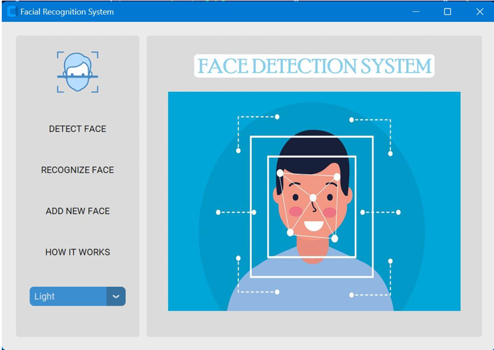
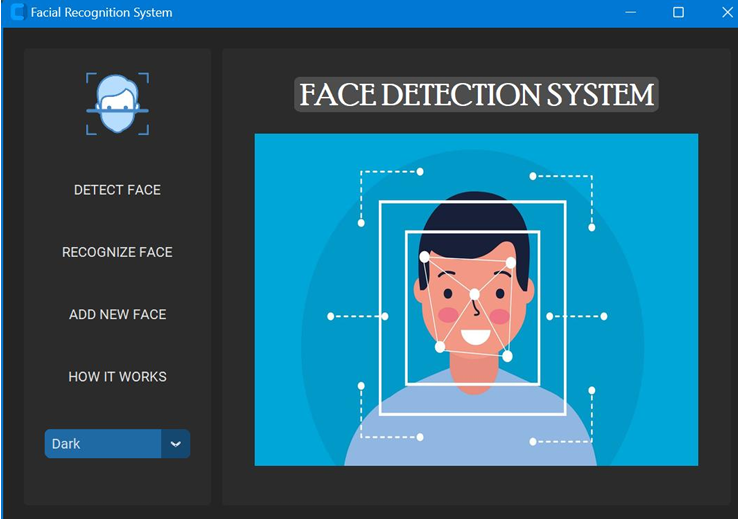
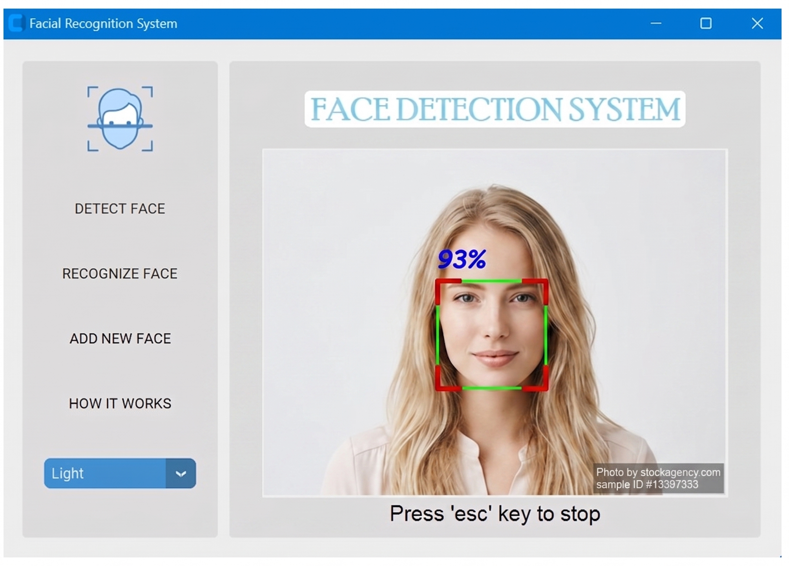
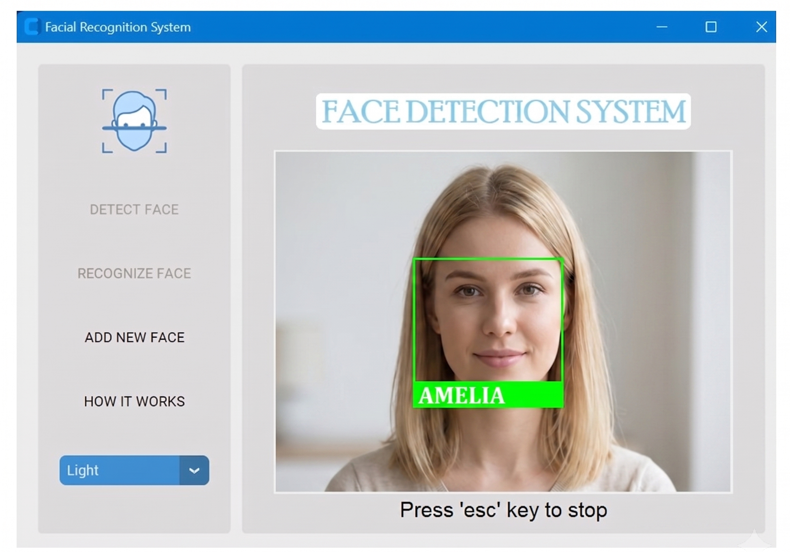
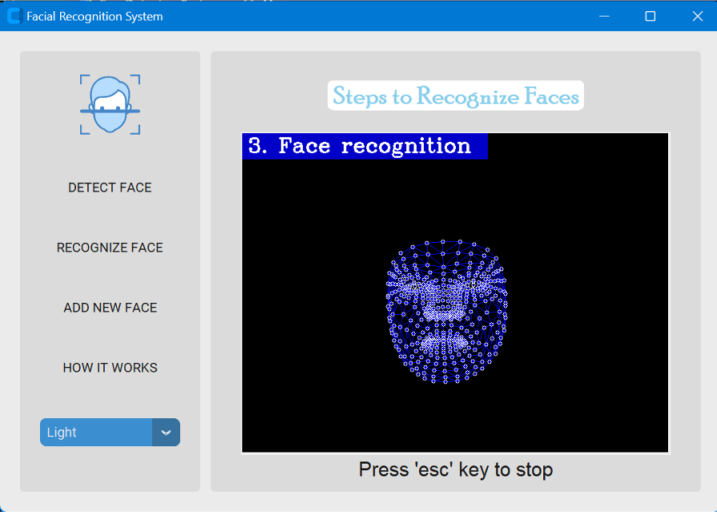
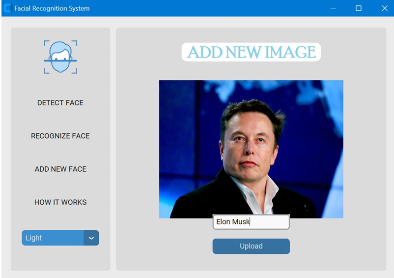
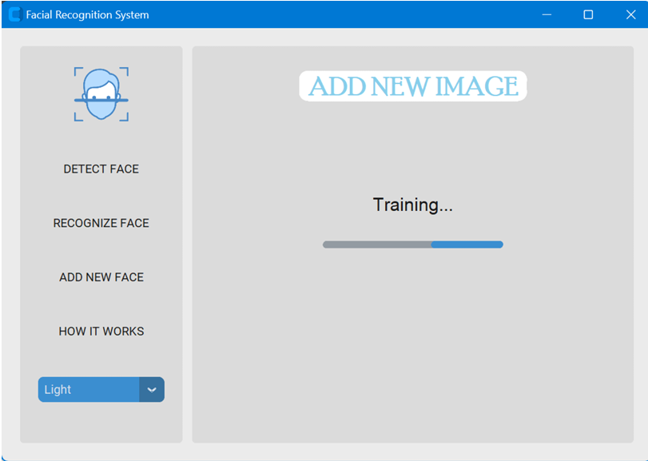

# 👤 Face Detection & Recognition System

**See faces. Know faces. Instant biometric identification at your fingertips.**

Ever wanted to build a smart security system that actually works? This is it—a blazing-fast face detection and recognition engine packed into an intuitive, polished desktop app that runs on your machine, no cloud required.

---

<p align="center">
  
  <br/>
  <em>Clean, modern interface with detection bounding boxes</em>
</p>

---

## 🔍 What is this?

A real-time **face detection and recognition system** that identifies people in live webcam feeds with 92% detection accuracy and 98% recognition precision. Train it with new faces in seconds, then watch it recognize them instantly.

Perfect for security systems, attendance tracking, access control, or any application that needs to know *who just walked in*.

---

## 📸 Live Demo

<div align="center" style="width: 100%;">
  
  <em>Real-time detection with bounding boxes and face localization</em>
</div>

<div align="center" style="width: 100%; margin-top: 16px;">
  
  <em>Dark theme for comfortable viewing in any lighting</em>
</div>

<div align="center" style="width: 100%; margin-top: 16px;">
  
  <em>Real-time webcam stream with multiple face detection</em>
</div>

<div align="center" style="width: 100%; margin-top: 16px;">
  
  <em>Recognized faces labeled with identity (e.g., "AMELIA") and confidence</em>
</div>

<div align="center" style="width: 100%; margin-top: 16px;">
  
  <em>Three-step pipeline: detection → feature extraction → recognition</em>
</div>

<div align="center" style="width: 100%; margin-top: 16px;">
  
  <em>Upload and train the model with new people in seconds</em>
</div>

<div align="center" style="width: 100%; margin-top: 16px;">
  
  <em>Real-time training feedback — model learns and updates instantly</em>
</div>

---

## ✨ Key Features

**Detect** — Finds faces in real-time video with 92% accuracy, handles multiple faces simultaneously, robust under varying lighting and angles

**Recognize** — Matches detected faces against your database with 98% accuracy and 99% precision, updates instantly when you train on new faces

**Train** — Add new people to the system in seconds—just upload a photo and click train

**Theme Toggle** — Switch between light and dark modes on the fly for comfortable viewing in any lighting

**Step-by-Step Visualization** — Watch the three-step pipeline: detection → feature extraction → recognition

**Clean GUI** — Built with Tkinter and CustomTkinter, modern widgets, responsive layout

---

## 🛠️ Tech Stack

- **Python 3.8+** — Core language
- **OpenCV** — Video capture and image processing
- **Tkinter / CustomTkinter** — Modern cross-platform GUI
- **MediaPipe** — 468-point facial landmark detection
- **face_recognition (Dlib)** — Deep learning-based face encoding and comparison
- **NumPy, Pandas** — Numerical operations and data handling

---

## 📊 Performance Metrics

- **Detection Accuracy:** 92% (faces found in frame)
- **Recognition Accuracy:** 98% (correct identification)
- **Precision:** 99% (minimal false positives)
- **Recall:** 98% (catches nearly all known faces)
- **F1 Score:** 96% (balanced performance)

*Tested on diverse datasets including different poses, lighting, scales, and occlusions.*

---

## 🚀 Quick Start

### Prerequisites
- Python 3.8+
- Webcam (for live detection/recognition)
- ~200MB disk space for dependencies

### Installation

```bash
# Clone the repository
git clone https://github.com/yourusername/face-detection-system.git
cd face-detection-system

# Install dependencies
pip install -r requirements.txt
```

### Run It

```bash
python FaceDetectionSystem.py
```

The GUI will launch. From there:
1. **DETECT FACE** — Real-time face detection from webcam
2. **RECOGNIZE FACE** — Identify known faces in the video
3. **ADD NEW FACE** — Upload a photo and train the model with a new person
4. **HOW IT WORKS** — Visualize the three-step pipeline

Press `ESC` to stop any mode and return to the menu.

---

## 📖 How It Works

The system follows a three-step pipeline, visualized in real-time:

**Step 1: Detection** — Haar Cascade classifier locates face regions in the frame and draws bounding boxes

**Step 2: Feature Extraction** — MediaPipe extracts 468 facial landmarks, creating a precise map of facial geometry (see `05-recognition-steps.png` for the full pipeline)

**Step 3: Recognition** — Dlib encodes the landmarks as a deep learning vector, then matches against your database of known faces

All three steps happen in real-time on your CPU—no network calls, no cloud dependency, pure local processing.

---

## 🎛️ Customization

Edit `FaceDetectionSystem.py` to tweak:
- Detection confidence threshold (default 0.5)
- Recognition distance threshold (how picky matching should be)
- GUI theme colors
- Database location
- Video resolution and FPS

---

## 🔐 Privacy & Security

- All processing happens **locally** on your machine
- No data leaves your computer
- Face encodings stored locally in a simple database
- No internet required

---

## 🤝 Contributing

Issues and PRs welcome. Easy ways to help:
- Add emotion recognition or age estimation
- Support 3D face detection
- Improve accuracy on masked or occluded faces
- Add export/import for face databases
- Optimize for lower-end hardware

---

## 📄 License

MIT — Use it freely, modify it, ship it.

---

## 🚨 Known Limitations

- Performance drops with faces smaller than ~50×50 pixels
- Best results with frontal or near-frontal poses
- Strong backlighting can reduce accuracy
- No built-in anti-spoofing (liveness detection) yet

---
